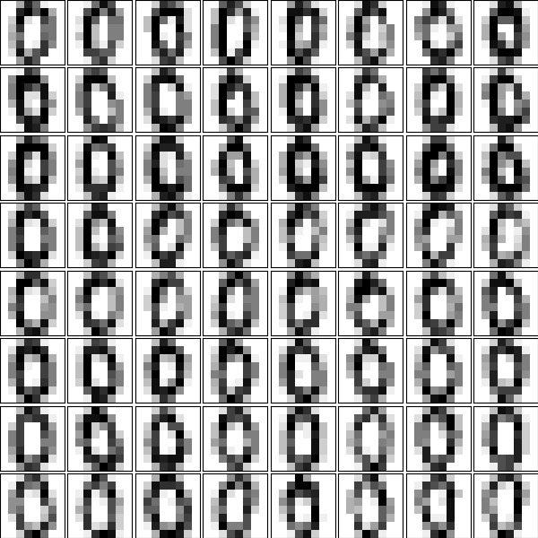
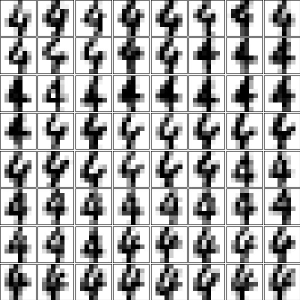

# AdaBoost - Praktikumsaufgabe
In dieser Praktikumsaufgabe implementieren Sie den AdaBoost Algorithmus am Beispiel des "Digits"-Datensatz aus SciKit Learn. 
Der Digits-Datensatz besteht aus Schwarz-weiß Bildern von handgezeichneten Ziffern mit 8x8 Pixeln Auflösung. Jeder Pixel kann 16 
verschiedene Helligkeitsstufen annehmen und es sind alle Ziffern von 0 bis 9 im Datensatz abgebildet. 

|  |
|:--:|
|Beispiele für die Ziffer 0*|

|  |
|:--:|
|Beispiele für die Ziffer 4*|

## AdaBoost - Highlevel
AdaBoost ist ein Verfahren aus dem Bereich "Data Science" und "Maschinellem Lernen". Die Idee ist es aus einer Vielzahl s.g. schwacher Klassifikatoren eine geeignete Kombination auszuwählen, so dass diese Kombination gemeinsam das Klassifikationsproblem zufriedenstellen lösen kann. Dabei bezeichnet der Begriff "Schwacher Klassifikator" einen Klassifikator, der gerade besser ist als einfaches Raten, der also gerade eben mehr als 50% Genauigkeit erreicht. 

AdaBoost verwaltet nun eine gewichtete Liste aller Trainingsbeispiele, initial ist dabei jedes Sample gleich wichtig, bekommt also das Gewicht 1 zugewiesen. Der Algorithmus bewertet alle möglichen Schwachen Klassifikatoren und wählt denjenigen Klassifikator aus, der den geringsten gewichtete Fehler verursacht. Es wird also zu jedem potentiellen Klassifikator und jedem Trainigsbeispiel überprüft, ob der Klassifikator dieses korrekt bzw. fehlerhaft klassifizieren würde. Dann werden die aktuellen Gewichte der fehlerhaft klassifizierten Trainingsbeispiele aufsummiert. Nachdem dies für alle potentiellen schwachen Klassifikatoren passiert ist wählt AdaBoost denjenigen Klassifikator aus, der diesen summarischen Fehler minimiert. Dieser Schritt ist in der Regel mit großem Rechenaufwand verbunden, weil zu jedem Klassifikator sämtliche Trainingsbeispiele bewertet werden müssen. 

Nachdem der aktuell bestmögliche aus den verfügbaren Klassifikatoren gewählt wurde ordnet AdaBoost diesem Klassifikator einen s.g. Alphawert zu. Dieser gibt an wie wichtig die Einzelentscheidung dieses Klassifikators später in der Gesamtentscheidung wird. Die finale Entscheidung der s.g. AdaBoost-Kasskade ergibt sich dabei als mit diesen Alphawerten gewichtete Summe der Einzelentscheidungen. Dabei wird in jedem Schritt der Alphawert so bestimmt, dass diese finale Entscheidung möglichst gut (also möglichst häufig richtig) wird. 

Nach Auswahl eines geeigneten Klassifikators sowie Bestimmung des dazugehörigen Alphawertes müssen alle Trainingsbeispiele für den nächsten Durchlauf neu gewichtet werden. Dabei werden solche Trainingsbeispiele höher (stärker) gewichtet, die bisher fehlerhaft klassifziert wurden. Gleichzeitig werden Trainingsbeipsiel, die bislang korrekt klassifiziert werden, niedriger (schwächer) gewichtet. Dies führt dazu das in der nächsten Auswahlrunde ein schwacher Klassifikator gewählt wird der mehr Wert auf die bisher fehlerhaften Trainingsdaten legt und daher tendenziell diese (bisherigen) Fehlentscheidungen wieder korrigieren kann. 

## Die Daten im Detail
Der Digits-Datensatz besteht aus insgesamt 1797 Bildern mit einer Auflösung von jeweils 8x8 Pixeln. 

    digits = sklearn.datasets.load_digits()
    print(digits.images.shape)

    (1797, 8, 8)
  
Jedes Bild ist es 2D NumPy Array mit 8 Zeilen und 8 Spalten. Ein einzelnes solches Bild sieht dabei so aus

    print(digits.images[300])

    [[ 0.  0.  1. 11. 16. 16. 10.  0.]
     [ 0.  0. 13. 14.  8. 12. 11.  0.]
     [ 0.  0.  4.  0.  0. 13.  4.  0.]
     [ 0.  0.  0.  0.  3. 15.  0.  0.]
     [ 0.  0.  2. 15. 16. 16.  9.  0.]
     [ 0.  0.  3. 13. 16.  8.  1.  0.]
     [ 0.  0.  0.  7. 10.  0.  0.  0.]
     [ 0.  0.  0. 13.  3.  0.  0.  0.]]

Bereits hier ist die grundlegende Struktur erkennbar, bei diesem Bild handelt es sich allem Anschein nach um eine sieben. 

Da die zwei-dimensionale Struktur für das weitere Vorgehen nicht relevant ist wandeln wir die Daten in 1-dimensionale Vektoren der Länge 64 um. 

    positive_class = digits.images[digits.target == 4].reshape(-1,64)
    print(positive_class[0])

    [ 0.  0.  0.  1. 11.  0.  0.  0.  0.  0.  0.  7.  8.  0.  0.  0.  0.  0.
      1. 13.  6.  2.  2.  0.  0.  0.  7. 15.  0.  9.  8.  0.  0.  5. 16. 10.
      0. 16.  6.  0.  0.  4. 15. 16. 13. 16.  1.  0.  0.  0.  0.  3. 15. 10.
      0.  0.  0.  0.  0.  2. 16.  4.  0.  0.]

In diesem Beispiel wählen wir zunächst alle Bilder aus, die der Zielklasse "vier" zugeordnet sind, die also vieren zeigen. Diese Bilder werden dann in 1-dimensionale Vektoren umgewandelt. In dieser Darstellung ist die Struktur nur noch bedingt erkennbar. Ordnen wir die Daten jedoch wieder anders an, erkennt man weiterhin die in dem Bild enthaltene vier

    [ 0.  0.  0.  1. 11.  0.  0.  0.  
      0.  0.  0.  7.  8.  0.  0.  0.  
      0.  0.  1. 13.  6.  2.  2.  0.  
      0.  0.  7. 15.  0.  9.  8.  0.  
      0.  5. 16. 10.  0. 16.  6.  0.  
      0.  4. 15. 16. 13. 16.  1.  0.  
      0.  0.  0.  3. 15. 10.  0.  0.  
      0.  0.  0.  2. 16.  4.  0.  0.]

Beachte: Dies sind die selben ein-dimensionalen Daten wie oben, es wurde lediglich für die Anzeige nach jeder achten Dimension ein Zeilenbruch eingefügt. 

Das Laden und Umstrukturieren der Daten geschieht in der load_digits Methode. Hier werden ebenfalls die Labels sowie die initialen Gewichte für die Daten festgelegt. Die Methode gibt dann drei NumPy Arrays zurück. Das erste enthält die konkatenierten 1D Daten für beide Klassen, das zweite die Klassenlabels, also eine 1 oder -1, jenachdem zu welcher der beiden Klasse das Bild gehört. Die Gewichte sind initial alle mit einer konstanten 1 gefüllt. 

    def load_data():
      # Load the Digits dataset
      # The digits dataset contains images of resolution 8x8 pixels. Each pixel contains values between 0 and 15. 
      # They resemble images of the hand-written digits 0 to 9
      digits = sklearn.datasets.load_digits()

      # Select two digits for classification. Flatten the images as we don´t need the 2D structure anyway
      positive_class = digits.images[digits.target == 4].reshape(-1,64)
      negative_class = digits.images[digits.target == 8].reshape(-1,64)
      positive_label = np.ones(positive_class.shape[0])
      negative_label = -np.ones(negative_class.shape[0])

      # Concatenate both into the same set  
      data = np.concatenate([positive_class, negative_class])
      labels = np.concatenate([positive_label, negative_label])

      # Start with equal weights for each sample
      weights = np.ones_like(labels)

      return data, labels, weights

    data, labels, weights = load_data()
    print(data.shape)
    print(labels.shape)
    print(weights.shape)

    ----

    (355, 64)
    (355,)
    (355,)

## Der Adaboost-Algorithmus im Detail
Es sei $\{(x_1, y_1), \dots (x_n, y_n)\}$ ein Datensatz, wobei jedes Feature $x_i$ eine dazugehörige Klasse $y_i\in\{-1, 1\}$ hat. 

Ausserdem sei $\mathcal{K} = \{\kappa_1,\dots,\kappa_L\}$ eine Menge von möglichen Klassifikatoren. 

Dabei ist $\kappa_j(x_i) \in \{-1, 1\}$, d.h. jeder Klassifikator $\kappa_j$ ordnet jedem Trainingsbeispiel $x_i$ ebenfalls entweder eine $-1$ oder eine $1$ zu. 

AdaBoost sucht nun eine Linearkombination von Klassifikatoren 

$$
\begin{equation}
  C_m(x_i) = \sum_{i=1}^m \alpha_i \kappa_i(x_i)
\end{equation}  
$$ 

also zu jedem Klassifikator $\kappa_i$ ein dazugehöriges $\alpha_i$ (Alphawert), so dass die gewichtete Summe der Einzelentscheidungen eine neue Gesamtentscheidung gibt. 

Die Idee ist nun diese Klassifikatoren iterativ auszuwählen, also zunächst mit nur einem Klassifikator zu starten und dann sukzesive neue Klassifikatoren auszuwählen. 

### Die Fehlerfunktion
Wir definieren dazu eine geeignete Fehlerfunktion

$$
\begin{equation}
  E = \sum_{i=1}^N \exp\left(-y_i C_m(x_i)\right)
\end{equation}
$$

Dabei ist der Exponent $-y_i C_m(x_i)$ genau dann negativ, wenn $y_i$ und $C_m(x_i)$ das selbe Vorzeichen haben, die Kaskade $C_m$ das Trainingsbeispiel also korrekt vorhersagt. In diesem Fall ist der Term $\exp(-y_i C_m(x_i))$ kleiner 1 und konvergiert gegen 0, je (betragsmäßig) größer der Wert $C_m(x_i)$ wird. Das entspricht der Idee, dass je sicherer der Klassifikator $C_m$ in seiner Entscheidung ist, um so geringer ist der angenommene Fehler $E$. 

Gleichzeit ist der Exponent $-y_i C_m(x_i)$ genau dann positiv, wenn $y_i$ und $C_m(x_i)$ unterschiedliche Vvorzeichen haben, die Kaskade $C_m$ das Trainingsbeispiel also falsch vorhersagt. Der Term $\exp(-y_i C_m(x_i))$ ist dann größer 1 und konvergiert gegen unendlich für größere Konfidenz $C_m$. 

Insgesamt macht die vorgeschlagene Fehlerfunktion $E$ also Sinn. 

### Auswahl eines geeigneten neuen Klassifikators für die Kaskade
Um einen neuen Klassifikator in die Kaskade aufzunehmen müssen wir ein geeignetes Kriterium finden, nachdem dieser ausgewählt werden soll. Dazu schreiben wir Gleichung (1) als 

$$
\begin{equation}
  C_m(x_i) = C_{(m-1)}(x_i)
           + \alpha_m \kappa_m(x_i)
\end{equation}           
$$

Damit können wir die Fehlerfunktion (2) schreiben als

$$
  E = \sum_{i=1}^N \exp(-y_i C_{(m-1)}(x_i))
              \cdot \exp(-y_i \alpha_m \kappa_m(x_i))
$$

Dabei ist der erste Produktterm unabhängig von $\alpha_m$ oder der Wahl des Klassifikators $\kappa_m(x_i)$. Wir kürzen ab und schreiben
$\omega_i^{(m)} = \exp(-y_i C_{(m-1)}(x_i))$, also auch 

$$
\begin{equation}
  E = \sum_{i=1}^N \omega_i^{(m)}
              \cdot \exp(-y_i \alpha_m \kappa_m(x_i))
\end{equation}              
$$

Nun trennen wir die Summe in Gleichung (4) indem wir über die korrekt klassifizierten sowie die nicht korrekt klassifizierten Beispiel nacheinander summieren. Die korrekt klassifizierten Trainingsbeispiele zeichnen sich durch die Eigenschaft $y_i = \kappa_m(x_i)$ aus, in diesem Fall ist das Vorzeichen von $y_i\cdot \kappa_m(x_i)$ positiv. Die falsch klassifizierten Trainingsbeispiele erfüllen $y_i\neq\kappa_m(x_i)$, also auch $y_i\cdot\kappa_m(x_i) < 0$ mit negativem Vorzeichen. Damit schreiben wir (4) als

$$
\begin{equation}
  E = \sum_{y_i=\kappa_m(x_i)} \omega_i^{(m)} \exp(-\alpha_m)
    + \sum_{y_i\neq\kappa_m(x_i)} \omega_i^{(m)} \exp(\alpha_m)
\end{equation}              
$$

Wenn wir nun in der linken Summe stattdessen wieder über alle Terme summieren und die zusätzlichen Terme in der rechten Summe wieder abziehen finden wir

$$
\begin{equation}
  E = \sum_{i=1}^N \omega_i^{(m)} \exp(-\alpha_m)
    + \sum_{y_i\neq\kappa_m(x_i)} \omega_i^{(m)} \left(
      \exp(\alpha_m) - \exp(-\alpha_m)\right)
\end{equation}              
$$

Nun sieht man das der linke Summand wieder nicht von der Wahl des konkreten Klassifikators $\kappa_m$ abhängt. Damit wird der Fehler $E$ minimal, wenn

$$
\begin{equation}
  \sum_{y_i\neq\kappa_m(x_i)} \omega_i^{(m)}
\end{equation}  
$$ 

minimal wird. Das bedeutet wir müssen aus allen möglichen Klassifikatoren $\kappa_m$ denjenigen auswählen, bei dem die gewichtete Summe über die *fehlerhaft* klassifizierten Trainingsbeispiele minimal wird. 

### Der Alpha-Wert
Nachdem der geeignete Klassifikator $\kappa_m$ bestimmt wurde bleibt noch der diesem Klassifikator zugeordnete Alpha-Wert zu bestimmen. Dazu leiten wird Gleichung (5) nach $\alpha_m$ ab und finden zunächst

$$
\begin{equation}
  \frac{\partial E}{\partial \alpha_m} = -\sum_{y_i=\kappa_m(x_i)} \omega_i^{(m)} \exp(-\alpha_m)
    + \sum_{y_i\neq\kappa_m(x_i)} \omega_i^{(m)} \exp(\alpha_m)
\end{equation}              
$$

Nullsetzen und umformen liefert dann 

$$
\begin{equation}
  \exp(-\alpha_m)
    \sum_{y_i=\kappa_m(x_i)} \omega_i^{(m)} =
  \exp(\alpha_m)
    \sum_{y_i\neq\kappa_m(x_i)} \omega_i^{(m)} 
\end{equation}
$$

Logarithmieren liefert dann

$$
\begin{equation}
  -\alpha_m
  +
  \ln\left(\sum_{y_i=\kappa_m(x_i)} \omega_i^{(m)}\right) =
  \alpha_m
  +
  \ln\left(\sum_{y_i\neq\kappa_m(x_i)} \omega_i^{(m)}\right)
\end{equation}
$$
und schließlich auch
$$\begin{equation}
  \alpha_m =
  \frac{1}{2}
  \ln\left(
     \frac{
        \sum_{y_i=\kappa_m(x_i)} \omega_i^{(m)}
     }{
        \sum_{y_i\neq\kappa_m(x_i)} \omega_i^{(m)} 
     }
    \right)
\end{equation}$$

Mit der gewichteten Fehlerrate 

$$
\epsilon_m = 
\frac{
        \sum_{y_i\neq\kappa_m(x_i)} \omega_i^{(m)}
     }{
        \sum_1^N \omega_i^{(m)} 
     }
$$

können wir Gleichung (11) schreiben als

$$
\begin{equation}
  \alpha_m = \frac12\ln\left(\frac{1-\epsilon_m}{\epsilon_m}\right)
\end{equation}  
$$
 
# Erste Aufgabe: Der schwache Klassifikator
**In dieser Aufgabe müssen sie die Klasse "WeakClassifier" sinnvoll implementieren**. 

Zunächst muß ein möglicher schwacher Klassifikator entwickelt werden. Das Ziel ist es dabei einen möglichst einfach Ansatz zu finden mit dem Trainingsbeispiele vielleicht (nicht notwendigerweise immer) korrekt klassifiziert werden können. Dabei ist es nicht nötig hohe Genauigkeiten zu erreichen. Es reicht völlig wenn der Klassifikator besser ist als Raten, also mehr als 50% Genauigkeit erreicht. Da im AdaBoost Algorithmus ohnehin aus einer Vielzahl von möglichen Kandidaten ein geeigneter Klassifikator ausgewählt wird ist es nicht einmal nötig das jeder einzelne Klassifikator sinnvoll ist. Es reicht völlig wenn in der Auswahl an möglichen Klassifikatoren mindestens einer dabei ist, der besser ist als einfaches Raten. 

**Implementieren Sie** dazu einen ganz einfachen schwachen Klassifikator. Wählen Sie dazu zufällig zwei Dimensionen aus dem 64-dimensionalen Datenvektor aus. Vergleichen Sie dann die Einträge in beiden Dimensionen und klassifizieren Sie ein Trainingsbeispiel als positiv wenn der Wert in der ersten Dimension größer oder gleich dem Wert in der zweiten Dimension ist. 

Hinweis: Die gewählten Dimensionen müssen für jeden Klassifikator fixiert werden, d.h. für alle Trainingsbeispiele müssen die selben Dimensionen verglichen werden. Initialisieren Sie diese zufällige Wahl sinnvollerweise im Konstruktur der Klasse. 

Hinweis 2: In den meisten Kombinationen von zwei Feature-Dimensionen entsteht so kein sinnvoller Klassifikator. Das ist aber auch nicht wichtig solange nur die Chance besteht das mit etwas Glück auch ein sinnvoller Klassifikator dabei ist. Der AdaBoost Algorithmus wird diesen dann später finden und auswählen.

    class WeakClassifier:
      def __init__(self, nFeatures):
        # TODO: Initialize stuff you need here
        self.alpha = 1.0 # The Alpha-Value for later if this classifier is picked

        # The weak classifier shall pick two random dimensions out of the 
        # feature vector. It will classify a sample as positive if featureA is bigger or equal than featureB
      
      def predict(self, samples):
        # TODO: Implement classifier prediction
        # Predict is an (N x 64) array, holding all feature vectors of 
        # the N samples, each 64-dimensional. 
        # Your task is to (weakly) classify each individual sample
        # as described in the task description. 
        # The expected return value is an (N x 1) array with only 
        # +1 or -1 in it. Return +1 if the sample is classified positve
        # and -1 if the sample is classified negative. Return nothing else
        # than -1 or +1. 
        pass

# Zweite Aufgabe: Der Auswahl eines neuen Klassifikators
**In dieser Aufgabe müssen Sie die Methode pick_weak_classifier sinnvoll implementieren** 

Um einen geeigenten schwachen Klassifikator auszuwählen erhält die Methode alle Daten mit dazugehörigen Labels und Gewichten sowie eine Auswahl an möglichen schwachen Klassifikatoren. Gemäß Gleichung (7) (vgl. oben) müssen wir denjenigen Klassifikator wählen, welcher die Summe der Gewichte für alle *falschklassifizierten* Samples minimiert. 

**Implementieren Sie die Methode entsprechend**

    def pick_weak_classifier(data, labels, weights, classifiers):
      # TODO: Implement the picking stage of the AdaBoost Algorithm.
      # We try to find the one classifier out of the given classifiers
      # which minimize the sum of weights for wrongly classifier samples
      #
      # data is a (N x 64) array containing all the training samples
      # labels is a (N x 1) array containing 1 or -1 depending on whether 
      # the sample is positive or negative
      # weights is a (N x 1) array containing the weights for each sample
      # classifiers is a list of potential WeakClassifiers (see above)
      pass

# Dritte Aufgabe: Bestimmung des Alpha-Wertes und der neuen Gewichte
**In dieser Aufgabe müssen Sie die Methode build_one_stage implementieren**

Nachdem ein geeigneter Klassifikator ausgewählt wurde müssen Sie zunächst dessen Alpha-Wert bestimmen, vergleichen Sie dazu Gleichung (12) (s. oben).

Mit bekanntem Klassifikator und Alpha-Wert können dann auch die Gewichte für den nächsten Durchlauf bestimmt werden. Schauen Sie dazu Gleichung (4) an und überlegen Sie, wie sich die Gewichte im nächsten Durchlauf verändern. 

**Implementieren Sie die Methode entsprechend**

    def build_one_stage(data, labels, weights, classifiers, cascade):
      # Pick the best weak classifier given current weights
      classifier = pick_weak_classifier(data, labels, weights, classifiers)

      # TODO: Calculate the alpha-value for the choosen classifier
      # according to the script and store it within the classifier object 
      # for later reference

      # TODO: Update weights for each samples according to script
      
      # Remember alpha and add choosen classifier to cascade
      classifier.alpha = 0 # TODO: Replace with calculated alpha
      cascade.append(classifier)
      
      return weights, cascade

# Vierte Aufgabe:
**In dieser Aufgaben müssen Sie die predict_cascade Methode implementieren.**
Um die gesamte AdaBoost Kaskade auszuwerten muß die mit den Alphawerten gewichtete Summe aller einzelnen Klassifikatorentscheidungen gebildet werden. Vergleichen Sie dazu Gleichung (1) (s. oben)

**Implementieren Sie nun die Methode entsprechend**

    def predict_cascade(data, cascade):
      # TODO: Implement evaluation of the whole AdaBoost cascade
      # Data is an (N x 64) array containing all data samples
      # Cascade is a list of choosen classifiers. Their respective 
      # Alpha values are stored within the classifier object. 
      pass